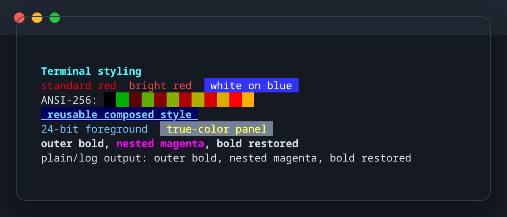
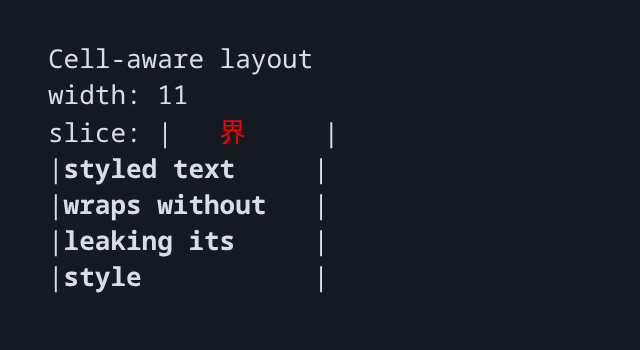

# TerminalStyles

TerminalStyles is a dependency-free, pure-Nim library for terminal colors,
text attributes, ANSI parsing, and Unicode terminal-cell layout. Importing it
does not print, query the terminal, or modify global state.

`terminal_styles` is the shared styling foundation for `terminal_graphs` and
`terminal_tables`, but can also be used independently.

Requires Nim 2.0.0 or newer.

## Colors and attributes

Import the façade to access the complete core API:

```nim
import terminal_styles

echo red("failed after ", 3, " attempts")
echo bgBrightBlue(brightWhite(" healthy "))
echo rgb(120, 200, 255, "true color")
echo onIndexed(235, brightYellow(" warning "))
```



`TerminalColor` supports the standard and bright 16-color palette, all 256
indexed colors, 24-bit RGB values, and three- or six-digit hexadecimal values:

```nim
let heading = initTerminalStyle(
  foreground = hexColor("#78c8ff"),
  background = indexedColor(17),
  attributes = {taBold, taUnderline}
)

echo styled(heading, "Terminal output")
```

Nested helpers restore the outer style after an inner reset. To produce plain
logs or redirected output, pass `enabled = false`; existing complete ANSI
controls are removed too:

```nim
let decorated = bold("outer ", red("inner"), " outer")
echo applyStyle(decorated, heading, enabled = false)
```

## Curated RGB palettes

Import the opt-in palettes module when you want a coherent set of exact color
choices instead of selecting individual RGB shades:

```nim
import terminal_styles/palettes

let colors = defaultDarkPalette

echo foreground(colors.red, "failed")
echo foreground(colors.blue, "information")
echo styled(initTerminalStyle(foreground = colors.cyan), "heading")
```

`ansiPalette` uses terminal-controlled ANSI-16 colors. The original
`defaultDarkPalette` and `defaultLightPalette` presets provide exact RGB
values designed against `#101418` and `#F7F8FA` respectively. Palettes are
ordinary immutable values: importing the module does not select one globally
or change helpers such as `red()`.


See the [color palette guide](docs/color-palettes.md) for exact values,
contrast context, custom palettes, and guidance on choosing a preset.

## ANSI parsing

`tokenizeAnsi` losslessly separates plain text, CSI controls, OSC controls, and
two-byte escape sequences. Only complete sequences are treated as controls.
Malformed or unterminated input remains ordinary text, so content is never
silently discarded.

```nim
let link = "\e]8;;https://example.com\e\\docs\e]8;;\e\\"
doAssert stripAnsi(link) == "docs"

for token in tokenizeAnsi(link):
  echo token.kind, ": ", token.value
```

OSC-8 hyperlinks terminated by BEL or ST are recognized.

## Terminal-cell layout

`displayWidth` measures cells rather than bytes or Unicode code points. It
handles combining marks, East Asian wide characters, variation selectors,
emoji modifiers, regional-indicator flags, and emoji joined with ZWJ. For
multiline strings it returns the widest line.

```nim
doAssert displayWidth("e\u0301") == 1
doAssert displayWidth("界") == 2
doAssert displayWidth("👨‍👩‍👧‍👦") == 2
```

Layout helpers retain active SGR styles and OSC-8 hyperlinks and never split a
wide or joined grapheme:

```nim
let value = bold("status: 界 ready")

echo sliceAnsi(value, startCell = 8, maxWidth = 4)
echo truncateAnsi(value, maxWidth = 12, suffix = "…")
echo "|", padAnsi(value, 24, alignCenter), "|"

for line in wrapAnsi(value, 10, wrapWords):
  echo line
```



`sliceAnsi`, `truncateAnsi`, and `padAnsi` operate on one display line.
`wrapAnsi` honors explicit newlines and supports `wrapWords` and
`wrapCharacters`. Widths and offsets are validated early.

Terminal width conventions differ for a small number of ambiguous Unicode
characters and can be configured by individual terminal emulators. This
library uses the common narrow interpretation for ambiguous characters and a
two-cell interpretation for emoji.

## Modules

- `terminal_styles/ansi` contains tokenization, stripping, and low-level ANSI
  composition.
- `terminal_styles/colors` contains colors, attributes, styles, constants, and
  convenience helpers.
- `terminal_styles/palettes` is an opt-in module containing reusable color
  palettes and re-exporting the color and style API.
- `terminal_styles/widths` contains cell measurement, slicing, truncation,
  padding, and wrapping.
- `terminal_styles` imports and exports ANSI, colors, and widths. Palette
  preset names remain opt-in.

Most applications should import only `terminal_styles`; import
`terminal_styles/palettes` when using palette presets.

## Example

The finite showcase can be compiled directly while developing:

```sh
nim c -r examples/terminal_styles.nim
```

## Development

```sh
nimble test
nimble examples
nimble docs
```

The example coverage audit is in [`docs/public-api.md`](docs/public-api.md).
Release history, contribution rules, third-party declarations, and the release
procedure live in `CHANGELOG.md`, `CONTRIBUTING.md`,
`THIRD_PARTY_NOTICES.md`, and `RELEASING.md`.
