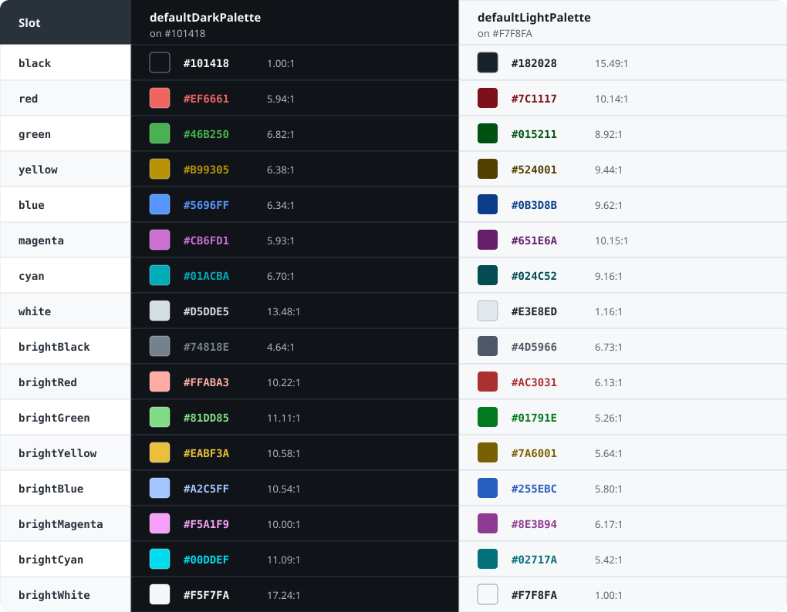

# Color palettes

`terminal_styles/palettes` provides coherent, immutable sets of standard and
bright colors. It is an opt-in module that re-exports the ordinary color and
style API, so it can be imported on its own:

```nim
import terminal_styles/palettes

let colors = defaultDarkPalette

echo foreground(colors.red, "failed")
echo foreground(colors.blue, "information")

let heading = initTerminalStyle(
  foreground = colors.cyan,
  attributes = {taBold, taUnderline}
)
echo styled(heading, "Terminal output")
```

Palettes are plain values. Importing this module does not select a palette,
modify global state, or change existing helpers such as `red()`. Pass a
palette field anywhere a `TerminalColor` is accepted.

## Built-in palettes

- `ansiPalette` contains the existing terminal-controlled ANSI-16 colors.
- `defaultDarkPalette` contains exact RGB colors designed against `#101418`.
- `defaultLightPalette` contains exact RGB colors designed against `#F7F8FA`.

The dark and light palettes are original to TerminalStyles rather than ports
of named third-party themes.



The contrast ratio shown for each value is measured against that palette's
reference background. Selecting a palette does not apply the background or
detect whether the terminal is light or dark. Actual contrast changes when
the terminal uses a different background.

`defaultDarkPalette.black` is its reference background;
`defaultLightPalette.white` and `defaultLightPalette.brightWhite` are surface
colors. Their low foreground contrast is deliberate. All chromatic colors
and intended foreground neutrals exceed 4.5:1 against their reference
background, but that fixed measurement is not a general accessibility
guarantee. Applications should use text, symbols, or layout as well as color
when communicating meaning.

<details>
<summary>Exact values and reference contrast ratios</summary>

| Slot | Dark value | Dark contrast | Light value | Light contrast |
| --- | --- | ---: | --- | ---: |
| `black` | `#101418` | 1.00:1 | `#182028` | 15.49:1 |
| `red` | `#EF6661` | 5.94:1 | `#7C1117` | 10.14:1 |
| `green` | `#46B250` | 6.82:1 | `#015211` | 8.92:1 |
| `yellow` | `#B99305` | 6.38:1 | `#524001` | 9.44:1 |
| `blue` | `#5696FF` | 6.34:1 | `#0B3D8B` | 9.62:1 |
| `magenta` | `#CB6FD1` | 5.93:1 | `#651E6A` | 10.15:1 |
| `cyan` | `#01ACBA` | 6.70:1 | `#024C52` | 9.16:1 |
| `white` | `#D5DDE5` | 13.48:1 | `#E3E8ED` | 1.16:1 |
| `brightBlack` | `#74818E` | 4.64:1 | `#4D5966` | 6.73:1 |
| `brightRed` | `#FFABA3` | 10.22:1 | `#AC3031` | 6.13:1 |
| `brightGreen` | `#81DD85` | 11.11:1 | `#01791E` | 5.26:1 |
| `brightYellow` | `#EABF3A` | 10.58:1 | `#7A6001` | 5.64:1 |
| `brightBlue` | `#A2C5FF` | 10.54:1 | `#255EBC` | 5.80:1 |
| `brightMagenta` | `#F5A1F9` | 10.00:1 | `#8E3B94` | 6.17:1 |
| `brightCyan` | `#00DDEF` | 11.09:1 | `#02717A` | 5.42:1 |
| `brightWhite` | `#F5F7FA` | 17.24:1 | `#F7F8FA` | 1.00:1 |

</details>

## Custom palettes

`initTerminalPalette` accepts all 16 slots as named arguments. Omitted slots
retain their corresponding ANSI colors, making partial customization useful:

```nim
const companyPalette = initTerminalPalette(
  red = hexColor("#dc4650"),
  blue = hexColor("#4682dc")
)

echo foreground(companyPalette.red, "company red")
echo foreground(companyPalette.green, "terminal-controlled green")
```

Palette fields can hold any `TerminalColor`, including ANSI-16, ANSI-256, and
RGB values. A custom palette can also be constructed directly as a
`TerminalPalette` object when setting every field explicitly is preferable.

## Choosing a palette

Use `ansiPalette` when the terminal emulator should control the displayed
shades or true-color support cannot be assumed. Use one of the curated
palettes when the application knows whether its output will appear on a dark
or light background and exact RGB colors are desired.

The library intentionally provides no automatic background detection or
global active palette. This keeps output deterministic and preserves its
side-effect-free import behavior.
